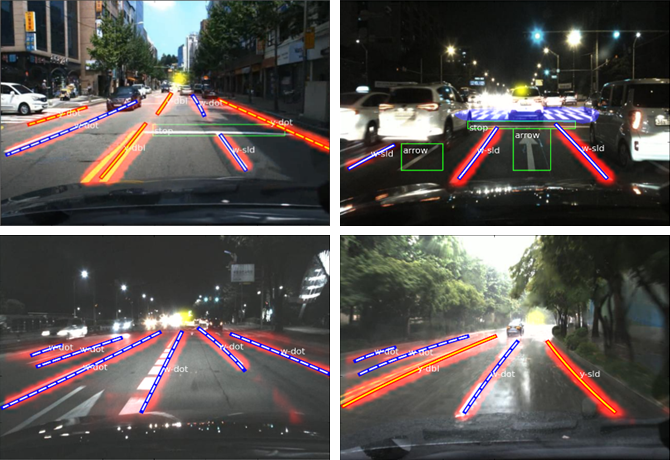

# [VPGNet: Vanishing Point Guided Network for Lane and Road Marking Detection and Recognition]

ICCV 2017 (to be published)

In this paper, we propose a unified end-to-end trainable multi-task network that jointly handles lane and road marking detection and recognition that is guided by a vanishing point under adverse weather conditions. We tackle rainy and low illumination conditions, which have not been extensively studied until now due to clear challenges. For example, images taken under rainy days are subject to low illumination, while wet roads cause light reflection and distort the appearance of lane and road markings. At night, color distortion occurs under limited illumination. As a result, no benchmark dataset exists and only a few developed algorithms work under poor weather conditions. To address this shortcoming, we build up a lane and road marking benchmark which consists of about 20,000 images with 17 lane and road marking classes under four different scenarios: no rain, rain, heavy rain, and night. We train and evaluate several versions of the proposed multi-task network and validate the importance of each task. The resulting approach, VPGNet, can detect and classify lanes and road markings, and predict a vanishing point with a single forward pass. Experimental results show that our approach achieves high accuracy and robustness under various conditions in real-time (20 fps). The benchmark and the VPGNet model will be publicly available. 

## Supplementary
+ https://www.youtube.com/watch?v=jnewRlt6UbI

## Demo Code
+ To be opened

## Dataset Contact
+ All rights about the dataset are preserved by Samsung Electronics Co.
+ Please contact [Tae-Hee Lee](mailto:th810.lee@samsung.com), [Hyun Seok Hong](mailto:hyunseok76.hong@samsung.com), and [Seung-Hoon Han](mailto:luoes.han@samsung.com) with questions and comments.

## Log
+ 09.11.2017: The "VPGNet" pages beta test
